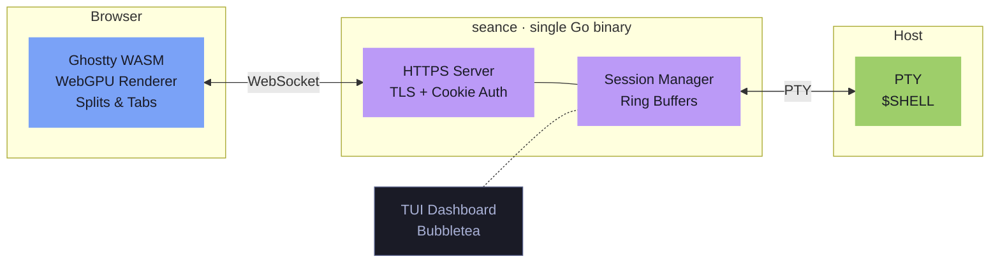

# seance

A real terminal in your browser. Single binary. Ghostty rendering. Zero compromise.



Seance embeds [Ghostty](https://ghostty.org)'s WASM terminal renderer and serves it over HTTPS. GPU-accelerated rendering, splits, session persistence — one `go build`.

## Demo

<!-- TODO: replace placeholders with actual screenshots -->

| Browser terminal | Splits |
|---|---|
|  |  |

| TUI Dashboard | Session switcher |
|---|---|
|  |  |

## Prerequisites

Install [Bazelisk](https://github.com/bazelbuild/bazelisk), which manages the correct Bazel version automatically:

```sh
# macOS
brew install bazelisk

# or via npm
npm install -g @aspect-bazel/bazelisk

# or download from https://github.com/bazelbuild/bazelisk/releases
```

## Quick start

```sh
# build
bazel build //cmd:run

# run (starts server + TUI)
SEANCE_PASSWORD=secret bazel run //cmd:run
# open https://localhost:8443

# run tests
bazel test //...
```

## Features

- **GPU-accelerated** — Ghostty's WebGPU renderer via WASM, not a DOM hack
- **Single binary** — frontend embedded with `go:embed`
- **Splits** — horizontal / vertical terminal panes
- **Session persistence** — reconnect to running sessions with scrollback
- **TLS by default** — auto-generates self-signed certs, or bring your own
- **TUI dashboard** — Bubbletea session manager in your terminal
- **Daemon mode** — run headless, attach from anywhere

## Usage

```
bazel run //cmd:run                       start server + TUI
bazel run //cmd:run -- daemon             headless server
bazel run //cmd:run -- attach [id]        attach to a session
bazel run //cmd:run -- list               list sessions
bazel run //cmd:run -- kill [id]          kill a session
bazel run //cmd:run -- stop               shut down a running daemon
```

## Configuration

| Variable | Default | |
|---|---|---|
| `SEANCE_PASSWORD` | *required* | `--no-password` to disable |
| `SEANCE_ADDR` | `:8443` | listen address |
| `SEANCE_SHELL` | `$SHELL` | default shell |
| `SEANCE_TLS_CERT` | *auto* | TLS cert path |
| `SEANCE_TLS_KEY` | *auto* | TLS key path |
| `SEANCE_BUFFER_SIZE` | `1048576` | scrollback per session |
| `NGROK_AUTHTOKEN` | | ngrok auth token (for `--ngrok`) |

### Flags

| Flag | |
|---|---|
| `--no-password` | Disable authentication |
| `--ngrok` | Start an ngrok tunnel for remote access |

### Remote access with ngrok

```sh
NGROK_AUTHTOKEN=<token> SEANCE_PASSWORD=secret bazel run //cmd:run -- --ngrok
```

This starts the local server as usual and also opens an ngrok tunnel. The public URL is printed in the logs and shown in the TUI.
