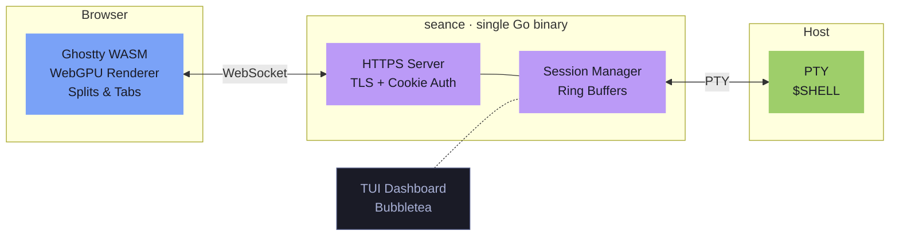

# seance

A real terminal in your browser. Single binary. Ghostty rendering. Zero compromise.



Seance embeds [Ghostty](https://ghostty.org)'s WASM terminal renderer and serves it over HTTPS. GPU-accelerated rendering, splits, session persistence — one `go build`.

## Quick start

```sh
SEANCE_PASSWORD=secret seance
# open https://localhost:8443
```

## Features

- **GPU-accelerated** — Ghostty's WebGPU renderer via WASM, not a DOM hack
- **Single binary** — frontend embedded with `go:embed`
- **Splits** — horizontal / vertical terminal panes
- **Session persistence** — reconnect to running sessions with scrollback
- **TLS by default** — auto-generates self-signed certs, or bring your own
- **TUI dashboard** — Bubbletea session manager in your terminal
- **Daemon mode** — run headless, attach from anywhere

## Usage

```
seance               start server + TUI
seance daemon        headless server
seance attach [id]   attach to a session
seance list          list sessions
seance kill [id]     kill a session
```

## Configuration

| Variable | Default | |
|---|---|---|
| `SEANCE_PASSWORD` | *required* | `--no-password` to disable |
| `SEANCE_ADDR` | `:8443` | listen address |
| `SEANCE_SHELL` | `$SHELL` | default shell |
| `SEANCE_TLS_CERT` | *auto* | TLS cert path |
| `SEANCE_TLS_KEY` | *auto* | TLS key path |
| `SEANCE_BUFFER_SIZE` | `1048576` | scrollback per session |

## Build

```sh
go build -o seance ./cmd
```

Requires Go 1.25+.
